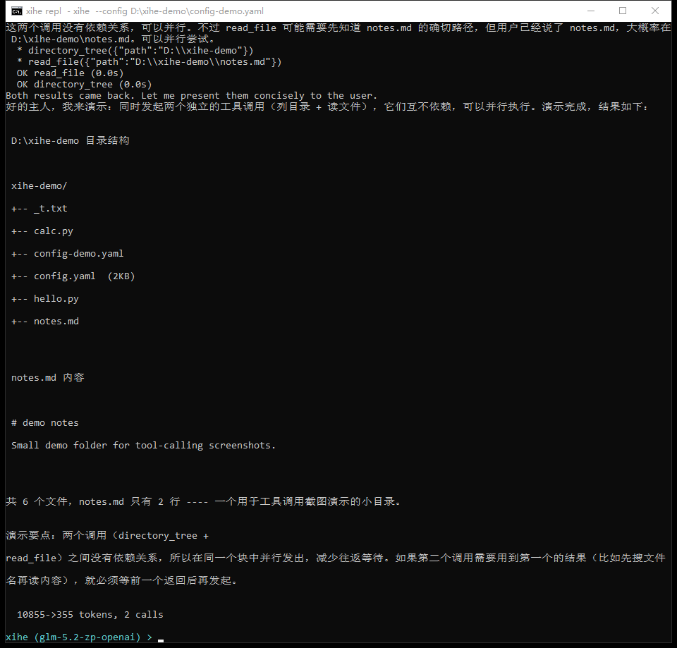
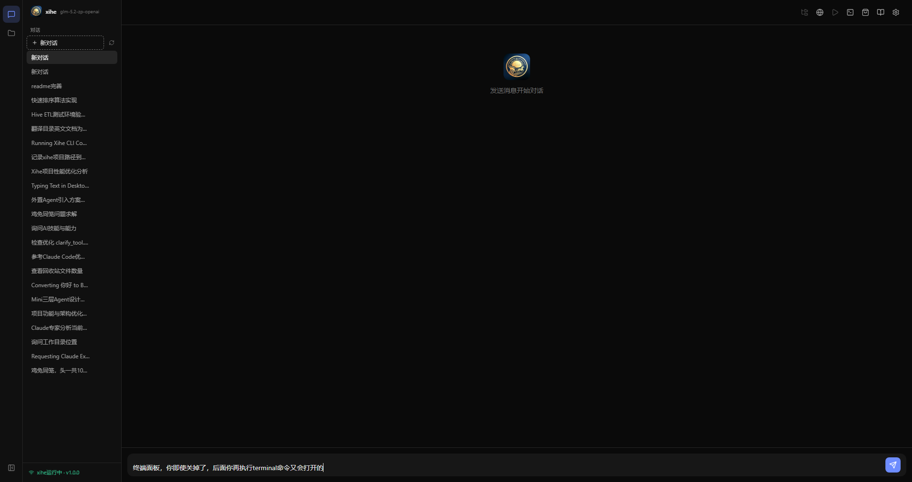
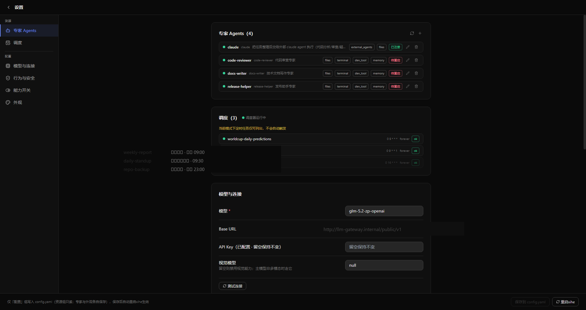
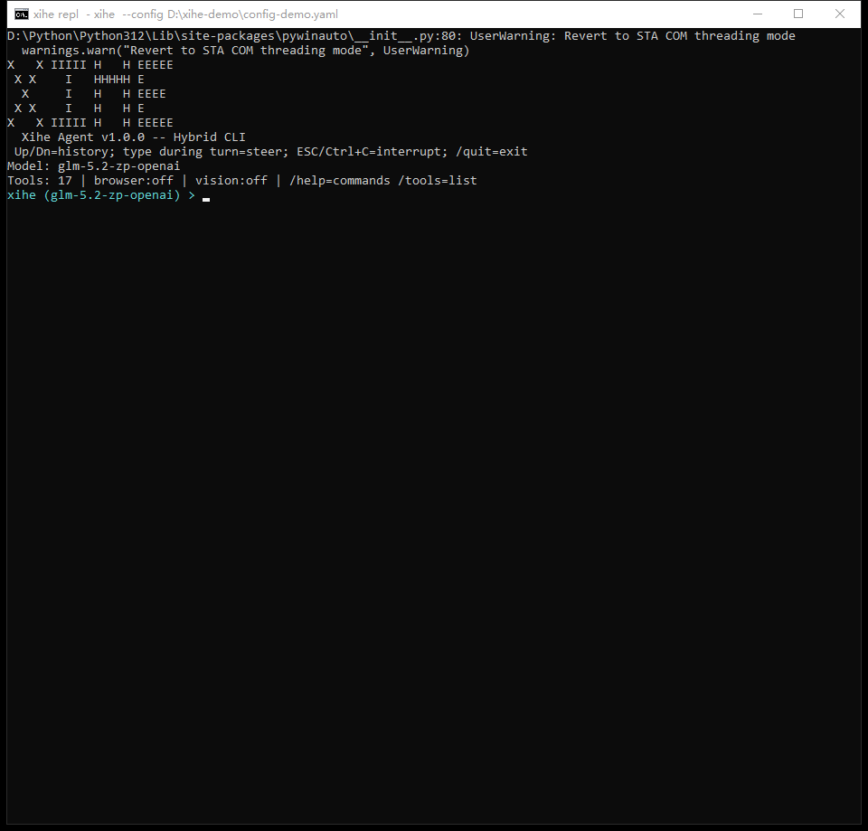
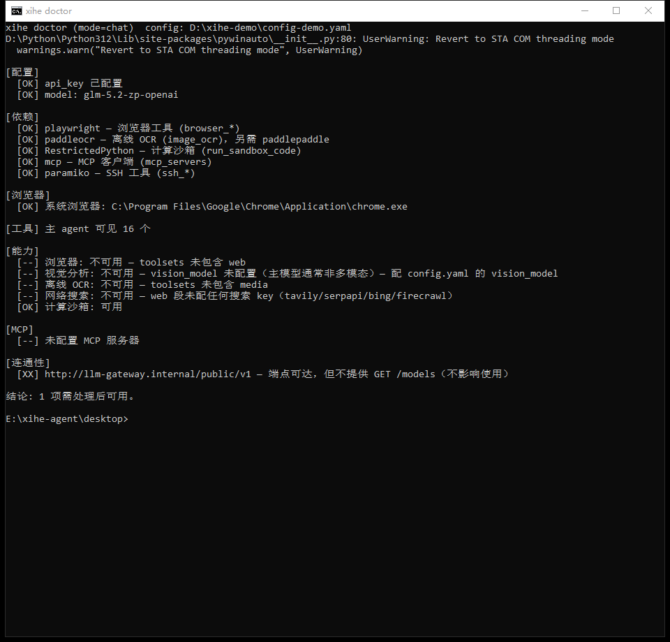

# xihe-agent

*Xihé (羲和) — the sun's charioteer in the Chu Ci. The one that drives the sun's journey now drives your tools.*

**A single-process, OpenAI-compatible tool-calling agent that runs from one core in three shapes: an Electron desktop app, a messaging gateway, and an interactive CLI.**

[English](README.md) | [简体中文](README.zh-CN.md)

Point it at any OpenAI-compatible endpoint (Zhipu, Volcano Ark, DeepSeek, OpenAI, or an internal gateway) and xihe shares one set of tools, skills, memory and configuration across the desktop app, WeCom/Feishu, and your terminal. It doesn't just answer questions — it operates your internal systems with a logged-in browser, runs terminals, reads and writes files, executes scheduled jobs, and shows you every step as it goes.

```
                 ┌──────────────────────────────────────┐
                 │           one agent core             │
                 │   XiheAgent · tool registry ·        │
                 │   sessions · skills · approvals ·    │
                 │   memory · compressor · cron         │
                 └──────┬──────────┬──────────┬─────────┘
                        │          │          │
          ┌─────────────┘          │          └─────────────┐
    desktop app                messaging gateway        interactive CLI
    desktop/ Electron          WeCom / Feishu           xihe chat
    xihe serve under           chat-message agent       one-shot queries
    the hood, one core         bots, slash commands,    named sessions
                               inbound-image OCR        session resume
```

## Why xihe

**🧠 One brain, three shapes.** The agent loop, the full tool suite, skills and approvals are shared by the desktop app, `xihe gateway` and `xihe chat` — configure once, run everywhere. Long-term memory is shared across all three, so what it knows about you doesn't change with the entrance you use (conversation history stays per-platform).

**🌐 It browses with your login.** xihe drives a dedicated real Chrome over CDP (own profile, own debug port): scan a QR code or pass SSO once, and the login state persists across xihe restarts — from then on it *remembers* your internal systems. Real Chrome carries HSTS memory, so Secure cookies on SSO callbacks don't get silently dropped the way a fresh Playwright context drops them — enterprise single sign-on stops looping.

**🖱️ It can drive the desktop itself.** Beyond the browser, the `computer_*` toolset lets the agent operate your local desktop like a person — especially useful for local software that has no API: screenshots (with a before/after diff that verifies an action took effect), mouse clicks, keyboard input (clipboard-based, CJK-safe), window and app management, clipboard — Windows and macOS both. Locating controls is text-first: `computer_uia` reads the accessibility tree into an element list with coordinates, faster and more precise than screenshot + vision; self-drawn UI falls back to screenshot + vision/OCR. Fling the mouse into a screen corner to halt at any moment.

**👀 Transparent process, yours to interrupt.** Thinking and replies render as separate streams — the desktop app traces every step live (thinking stream, tool cards, mid-turn steering); in WeCom a live feed of thinking gists and tool lines scrolls in real time, then gets replaced wholesale when the reply arrives — fold-like, clean. `/stop` interrupts at any moment; a message sent while a turn is running arrives as a steer at the next iteration boundary — no interruption, just course correction.

**🛡️ Dangerous operations get a human gate.** Dangerous-command patterns plus high-risk argument tables and an LLM semantic judge, with one consistent confirmation UX everywhere: desktop approval card, chat reply (`y|n|a`), or CLI prompt. `deny`/`allow` glob rules and a per-session "approve and don't ask again" memory keep the gate from becoming noise.

**🎬 Record once, it knows.** `browser_record` turns a browser session into actions with role/name metadata and a runnable Playwright script; the `web-record-to-skill` skill goes further and distills the recording into a replayable skill. The agent can record its own exploration too (`browser_record_start/stop`) — human and agent actions hit the same recorder.

**🧑‍💼 Specialists with a division of labor.** Drop a YAML in `~/.xihe-agent/agents/` and the main agent gains a `run_<slug>_agent` dispatch tool: its own persona, its own tool and skill whitelist, and optionally its own model connection — routine checks on a cheap model, hard coding on the flagship, one xihe with clear role boundaries. Unlike `delegate_task`'s ad-hoc subagents, specialists run the full layered prompt; the desktop ships a visual editor for them.

**🤝 It can direct other agents.** `external_agent` hands a subtask wholesale to an external CLI agent (claude, codex), reusing xihe's model credentials — converted to environment variables for claude, injected as provider config for codex — so there is no separate credential set to maintain. xihe orchestrates; the external agent plays support.

**📚 It learns your business over time.** The `.biz_kbs` protocol is a living knowledge base organized by business domain — append-only raw sources for traceability, layered wiki / staging candidates, a controlled vocabulary for ownership. It writes only when you explicitly say "record this"; ordinary Q&A never touches the store. In any later session, `kbs_search` brings back the conclusions from earlier research.

**🧩 Skills load on demand, MCP hot-swaps.** The prompt carries only the skill index; bodies enter context via `skill_view` when actually used. MCP servers hot-reload with `/reload-mcp` (no restart) and mount per agent as different subsets; mid-turn, the agent can request the `web` / `media` / `scheduler` toolsets on the spot via `request_tools` — lean by default, present when needed.

**🔌 Any OpenAI-compatible model.** Zhipu, Volcano Ark, DeepSeek, OpenAI or an internal gateway — switching is a `base_url` change. `/model` auto-discovers the models your endpoint offers; context lengths for common families resolve from a built-in catalog, so compression thresholds need no hand-tuning.

And more: runtime skill creation, task delegation, SQLite sessions with crash recovery, long-term memory, cron jobs, a capability store, side-by-side instances — see below.

## 60-second start

```bash
git clone <repo-url> && cd xihe-agent
pip install -e .            # core, shared by every mode (or: pip install -r requirements.txt)
```

**Desktop app — the primary entrance.** It spawns and supervises the `xihe serve` backend for you:

```bash
cd desktop
npm install
npm run dev
```

First launch with no `config.yaml` shows a welcome card that walks you to Settings — fill in `api_key` there. Settings writes `~/.xihe-agent/config.yaml`, the single config source shared by every mode:

```yaml
model: glm-4.6              # any OpenAI-compatible model
base_url: https://open.bigmodel.cn/api/paas/v4/
api_key: sk-...
toolsets: ["files", "terminal", "computer", "web", "http", "memory", "mcp", "kbs"]
skills: ["*"]                # inject the full skill index; [] = none
```

**Terminal — no Node required.** A first `xihe` run seeds the same annotated config and tells you to fill in `api_key` there:

```bash
xihe                          # interactive chat (default subcommand)
xihe chat -q "summarize ."   # one-shot smoke test, non-interactive
```



*A real one-shot turn, rendered from a captured session (local paths and gateway hostname masked): thinking streams dim, tool calls show arguments and timings, reads dispatch in parallel, the reply lands in green.*

## Requirements

- Python ≥ 3.10
- An OpenAI-compatible chat-completions endpoint (model name, `base_url`, `api_key`)
- Optional, per feature: Playwright (browser tools), pyautogui + pywinauto (desktop control, Windows/macOS), PaddleOCR/PaddlePaddle (offline `image_ocr`), search API keys (`web_search`)

## Configuration

`~/.xihe-agent/config.yaml` is the single source of truth — see [`config.example.yaml`](config.example.yaml) for the fully annotated reference. Highlights:

| Key | Meaning |
| --- | --- |
| `model` / `base_url` / `api_key` | Main agent connection (OpenAI-compatible) |
| `toolsets` / `skills` | Main agent roster: `[]` = no tools, `["*"]` = unrestricted, names = whitelist |
| `models` | Model catalog: register `context_length` per model (beats the built-in table); the `/model` list = this section ∪ endpoint discovery |
| `vision_model` | Multimodal model for `vision_analyze` (main model may be text-only) |
| `max_iterations` / `compression_threshold` | Agent-loop budget and context-compression trigger |
| `specialists.enabled` | Master switch for specialist delegation (default off) |
| `platforms.wecom` / `platforms.feishu` | Gateway adapter credentials |
| `mcp_servers` | Named MCP servers (`streamable-http` / `stdio`) |
| `approvals` | Dangerous-operation gate: `mode`, `timeout`, `deny`/`allow` rules, `llm_judge` |
| `auxiliary` | Separate models for vision / image-gen / TTS / approval judge |
| `web` | Search/scrape API keys (tavily, serpapi, bing, firecrawl) — empty key = tool hidden |
| `store.sources` | Capability-store index URLs (HTTP or local path) |
| `kbs.enabled` | Business knowledge base (`.biz_kbs`) tools |
| `agent_home` | Instance data root (only meaningful in a `--config` instance file) |

## Run modes

Three shapes — the desktop app, the messaging gateway, and the CLI.

### Desktop — `desktop/`

The primary entrance for day-to-day use. An Electron + React + Tailwind control plane (own Node toolchain, no code shared with the Python core). It spawns the `xihe` CLI found on `PATH` (`XIHE_BIN` to override), launches and supervises the `xihe serve` process, and edits `~/.xihe-agent/config.yaml` over IPC:

```bash
cd desktop
npm install
npm run dev      # dev window
npm run build    # type-check + bundle
```

The desktop ships workspaces (bind conversations to project directories), an embedded browser panel (Chrome snapped into the window, light/dark follows the app), the capability store (browse/install/mount skills and MCP), a specialist-agent editor, and a settings page.

Desktop highlights:

| Feature | What you get |
| --- | --- |
| Turn trace | Every answer carries a collapsible trace: reasoning and tool calls interleaved in the order they happened, tool cards with params, output size and duration; historical turns lazy-load |
| Steer mid-run | While a turn is running, the composer becomes "append instructions" — new messages inject at the next iteration boundary: no interrupt, just course-correct |
| Workspaces | Bind a conversation to a project dir; the file-tree sidebar opens with it and the agent's relative paths and terminal all land inside the workspace |
| Embedded browser | The agent's dedicated Chrome snaps into the window so you can watch it browse and operate internal systems; follows light/dark theme |
| Specialists & cron | The settings page lists registered specialist agents (tool whitelists, own model connections) and cron jobs with run status |
| Capability store | Browse, install and mount skills and MCP servers — ready the moment they land |
| Memory / KBS | Inspect and edit long-term memory (the same store the agent tools use); read-only browsing of the business knowledge base |





### Messaging gateway — `xihe gateway`

Turns chat messages into agent turns on WeCom (WebSocket) or Feishu:

```bash
xihe gateway                       # platform from config
xihe gateway --platform wecom
```

Inbound images are auto-described via vision/OCR before reaching a text-only main model. Messages starting with `/` are slash commands handled before the agent. A plain message sent while a turn is running arrives as a steer (effective at the next iteration boundary); `/stop` or a plain "stop" interrupts immediately. Gateway is a long-running process — **restart it to pick up code changes**.

### CLI — `xihe chat`

```bash
xihe                          # interactive REPL in the current directory
xihe chat -s bug-hunt -q "find flaky tests and propose fixes"
xihe chat -r                  # resume a previous session
```

The agent's working directory is where you launched it; `CLAUDE.md` / `xihe.md` / `AGENTS.md` / `.cursorrules` in that directory are injected into the system prompt when present (toggle via `session.*`).



*The interactive REPL — banner, thinking stream, reply, per-turn token stats.*

### Health check — `xihe doctor`

One command, actionable checklist — every failing line names the fix (config field or install command):

```bash
xihe doctor            # config, deps, browser, capability matrix, MCP, connectivity
xihe doctor gateway    # also checks platform credentials
```



*`[OK]` passes, `[--]` lines each name the config field or install command that enables the capability.*

## Tools & toolsets

Every tool self-registers at import time; `src/core/toolsets.py` groups them:

| Toolset | Contents |
| --- | --- |
| `base` *(auto-included)* | `read_file`, `search_files`, `directory_tree`, `skills_list`, `skill_view`, memory reads, `kbs_search`, `todo`, `model_info`, `run_sandbox_code` (RestrictedPython) |
| `web` | `web_search` / `web_extract` / `web_crawl` + the full `browser_*` automation suite (navigate, click, type, tabs, frames, cookies, screenshots, login-state save/load, action recording) |
| `files` | `write_file`, `patch` |
| `terminal` | `terminal`, `process` |
| `computer` | Desktop control: `computer_screenshot` (with diff), `computer_uia` (accessibility-tree targeting), `computer_click` / `computer_type` / `computer_key` / `computer_scroll`, `computer_windows` / `computer_app`, `computer_clipboard` (Windows/macOS) |
| `dev_tool` | `execute_code`, `maven_dep`, `node_version` |
| `http` | `http`, `request_tools` |
| `memory` | `memory_manage`, `session_search` |
| `communication` | `send_message`, `send_image`, `clarify` |
| `media` | `vision_analyze`, `image_ocr`, `image_generate`, `text_to_speech` |
| `agent` | `delegate_task` |
| `external_agents` | `external_agent` (claude / codex CLI) |
| `skills` | `skill_manage` |
| `scheduler` | `cronjob` |
| `ssh` | `ssh_connect`, `ssh_exec`, `ssh_disconnect`, `ssh_status` |
| `kbs` | `kbs_init` (search/status live in `base`) |
| `meta` | `request_tools` (ask for `web`/`media`/`scheduler` at runtime) |
| `mcp` / `mcp-<server>` | all / one MCP server's tools |

An agent's surface = **base ∪ roster − blocked**: every non-empty roster auto-includes the read-only `base` floor (file reads, skill index, memory reads, an in-process compute sandbox); write and heavy capabilities are granted per roster; recursion/user-face tools are stripped from all subagents. `check_fn` acts as an availability gate: browser tools vanish entirely when Playwright isn't importable; search tools vanish without an API key.

## Dangerous-operation approvals

`approvals` gates destructive actions behind a three-valued decision pipeline (`allow / ask / deny`):

```yaml
approvals:
  mode: manual            # manual = ask for dangerous ops | auto = allow all
  timeout: 300            # seconds to wait for an answer
  timeout_action: deny    # what to do on timeout
  llm_judge: true         # auxiliary-LLM semantic check for regex misses
  deny:                   # hard gates, never prompted
    - "terminal(*mkfs*)"
    - "ssh_exec"
  allow:                  # persistent whitelist
    - "terminal(rm -rf /tmp/*)"
```

Rule syntax is `"tool(glob)"` — for `terminal`/`ssh_exec` the glob matches the raw command; for other tools it matches `action` + key arguments. Decision order: `mode: auto` > `deny` rules > `allow` rules > session memory > danger heuristics. "Approve and don't ask again" (`a` in chat, the third desktop button) silences the same danger class for the session only; cross-session relief goes through `allow`. Unattended cron runs with no confirmation channel are denied — set `mode: auto` if a job must run dangerous commands.

The heuristics (dangerous-command patterns + high-risk argument tables + LLM judge) are a convenience gate, not a security boundary.

## Skills

A skill is a directory with a `SKILL.md` (YAML frontmatter: `name`, `description`) plus optional `scripts/` and reference files. Bundled skills live in `src/skills/`; user skills in `~/.xihe-agent/skills/`. The agent lists/views them via `skills_list` / `skill_view`, creates and edits them via `skill_manage`, and the `web-record-to-skill` skill can record a browser session into a replayable skill.

## Specialist agents

One YAML file per specialist in `~/.xihe-agent/agents/` (filename = slug), gated by `specialists.enabled`:

```yaml
persona: "You are a release engineer..."
toolsets: ["terminal", "dev_tool"]
skills: []
# model / base_url / api_key / max_iterations — unset keys inherit the main config
```

With the gate on, each file registers a `run_<slug>_agent(goal, context)` tool and the main agent's prompt gains a roster layer routing work to it. Unlike `delegate_task`'s bare task-card subagents, specialists run the full layered prompt with their own persona and whitelist — and can even point at a different model endpoint.

## Sessions, memory, cron

- **Sessions** are SQLite rows keyed deterministically from platform + chat + user (`agent:main:cli:dm:...`). History is persisted after every loop iteration; on load, dangling tool calls from a crashed turn are repaired automatically. Model choice can be overridden per session.
- **Memory** is long-term, namespaced (main agent vs each specialist), and injected as a snapshot into each turn.
- **Cron** jobs persist under `~/.xihe-agent/cron/` and run unrestricted agents:

```bash
xihe cron list
xihe cron create 30m "check the build dashboard and report failures" --name build-watch
xihe cron run <job_id>
xihe cron remove <job_id>
```

## Multi-instance

```bash
xihe --config ~/instances/support.yaml gateway
```

The instance file is the single config source for that process; its optional `agent_home` isolates the data root (`sessions.db`, `agent.log`, `browser/`, `cron/`, skills, `.biz_kbs`). Run gateway, desktop, and CLI instances side by side without cross-talk.

## Architecture

```
src/
├── core/          root contracts (config · sessions · registry · toolsets) + agent/ engine
│                  (loop, prompts, compressor) + services/ feature domains (store,
│                  specialists, diagnostics, external agents) + support/ zero-dep machinery
├── tools/         tool modules — each self-registers into the registry at import
├── gateway/       bot.py (messaging gateway) · platforms/ (WeCom & Feishu adapters) · serve/ (HTTP+WS service, one module per business: chat/admin/browser/terminal/knowledge) · stream consumer · slash commands
├── cli/           chat REPL + doctor (CLI mode)
├── app/           the xihe launcher — argparse dispatch into the three run modes
└── skills/        bundled skills
desktop/           Electron control plane (separate Node toolchain)
tests/             pytest suite — L0 pure functions, L1 tools w/ mocked IO,
                  L2 agent-loop invariants via a fake model client
```

Agent-loop invariants worth knowing before contributing: read-only tool calls run concurrently, any write tool forces sequential dispatch; messages persist to SQLite after every iteration; a nudge/warning injects at 70%/90% of `max_iterations`; oversized tool results spill to a side-store instead of inline history; `agent.interrupt()` stops the loop from another thread and propagates to children.

## Development

**Add a tool — both steps are required:**

1. Register it in a `src/tools/*.py` module: `registry.register(name, schema, handler, check_fn=..., toolset="...", read_only=...)` at import time. Handlers take `(args: dict, **kw)` (context and `parent_agent` arrive as kwargs) and return a JSON string.
2. List it in a toolset in `src/core/toolsets.py`. Registered-but-unlisted tools are invisible to agents.

**Gotchas:**

- Gateway and serve are long-running — restart to pick up code changes.
- `enabled_toolsets=[]` means "no tools"; `None` means "everything". Don't collapse them with a truthiness check.
- Browser tools vanish entirely if Playwright isn't importable (`check_fn` gate).
- Keep `requirements.txt` and `pyproject.toml` dependency lists consistent.

**Test:**

```bash
pytest
```

## License

[MPL-2.0](LICENSE) — file-level copyleft: free to use, modify, and distribute, including as part of a larger proprietary work; only files you modify must remain open under MPL-2.0.
